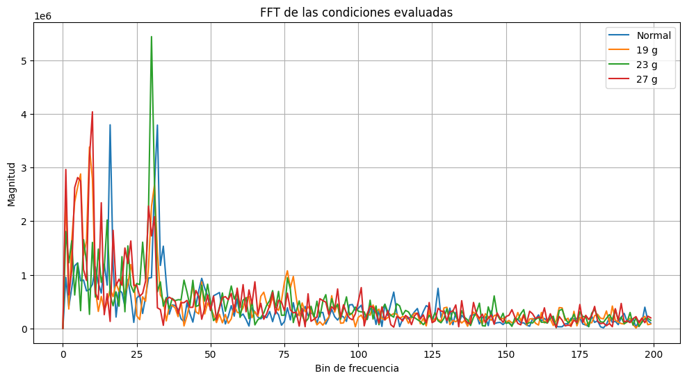

# Clasificación de Condiciones de Desbalance mediante Machine Learning

## Descripción
Proyecto desarrollado en la Facultad de Ingeniería de la Universidad Nacional de Asunción (FIUNA).

Se utilizaron señales de vibración obtenidas de un sistema rotativo para clasificar condiciones de desbalance mediante técnicas de Machine Learning.

## Objetivos
- Adquirir señales de vibración.
- Extraer características estadísticas y espectrales.
- Entrenar modelos de clasificación.
- Comparar desempeño entre algoritmos.

## Dataset

Condiciones evaluadas:

- Normal
- Unbalance 19 g
- Unbalance 23 g
- Unbalance 27 g

## Características extraídas

- RMS
- Peak
- Crest Factor
- Kurtosis
- Desviación estándar
- Frecuencia dominante
- Energía espectral
- Centroide espectral
- Bandwidth espectral

## Modelos evaluados

- Random Forest
- SVM

## Resultados

| Modelo | Accuracy CV |
|----------|------------|
| Random Forest | 76.8% |
| SVM | 45.6% |

Accuracy final en conjunto de prueba:

**93%**

## Visualizaciones

## Autores

- Fernando Benitez
- Manuel Arrom

FIUNA - 2026
