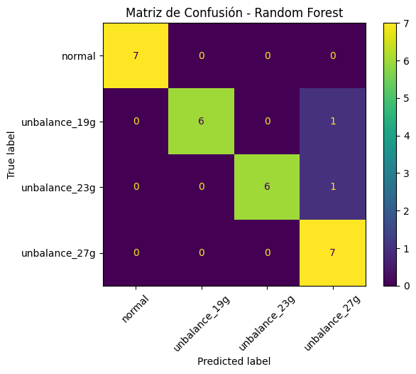

# Clasificación de Condiciones de Desbalance mediante Machine Learning

Proyecto desarrollado en la Facultad de Ingeniería de la Universidad Nacional de Asunción (FIUNA).

Se utilizaron señales de vibración obtenidas de un sistema rotativo para clasificar condiciones de desbalance mediante técnicas de Machine Learning.

## Objetivos
- Adquirir señales de vibración.
- Extraer características estadísticas y espectrales.
- Entrenar modelos de clasificación.
- Comparar desempeño entre algoritmos.

## Dataset

Condiciones evaluadas:

- Normal
- Unbalance 19 g
- Unbalance 23 g
- Unbalance 27 g

## Características extraídas

- RMS
- Peak
- Crest Factor
- Kurtosis
- Desviación estándar
- Frecuencia dominante
- Energía espectral
- Centroide espectral
- Bandwidth espectral

## Tecnologías utilizadas

- Python
- Pandas
- NumPy
- SciPy
- Scikit-Learn
- Matplotlib
- Jupyter Notebook

## Metodología

1. Adquisición de señales de vibración.
2. Segmentación de señales.
3. Extracción de características estadísticas y espectrales.
4. Construcción del dataset.
5. Entrenamiento de modelos de Machine Learning.
6. Evaluación mediante validación cruzada y conjunto de prueba.
   
## Modelos evaluados

- Random Forest
- SVM

## Resultados

| Modelo | Accuracy CV |
|----------|------------|
| Random Forest | 84.7% |
| SVM | 45.6% |

*Nota: Se actualizó el Accuracy CV de Random Forest en base al promedio de las iteraciones detalladas a continuación.*

### Detalle de Validación Cruzada (Random Forest)

Para proporcionar más detalle sobre el desempeño del modelo final (Random Forest), a continuación se presentan los resultados individuales por *fold* y las matrices de confusión correspondientes:

**Tabla de Accuracy por Iteración:**

| Fold | Accuracy |
|------|----------|
| 1    | 0.928571 |
| 2    | 0.821429 |
| 3    | 0.857143 |
| 4    | 0.888889 |
| 5    | 0.740741 |

**Resumen de Cross Validation:**
- **Accuracy promedio:** 0.8474
- **Accuracy máximo:** 0.9286
- **Accuracy mínimo:** 0.7407
- **Desviación estándar:** 0.0640

---
